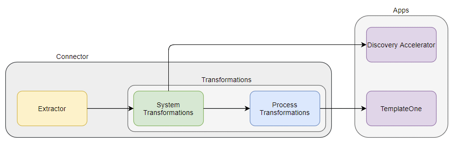
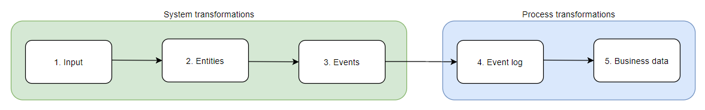

# Design specification
Connectors extract and transform data from the source system into a data model that is suitable for Process Mining. A connector consists of an *extraction* part and a *transformations* part. In the extraction part, raw data is copied from the source system into a database. This is achieved by using one of the extractors. In the transformation part, the raw data is transformed to the required data model.

## Extraction
In this step, the data from the source system is made available in the database where the transformations can run. The data is kept in the same format as in the original database. Transformations should not happen in this part. The following guidelines apply:
- Tables and fields that are not needed should not be loaded.
- The configuration instructions do not contain credentials or other secrets.
- The configuration instructions describe how to reduce data size. For example, by filtering on date ranges and other applicable concepts.

## Transformations
In this step, the extracted data is transformed to the required data model. Depending on the app for which the connector is developed, the data model is either the generic process mining model (TemplateOne) or the process specific models (Discovery Accelerators P2P and O2C).

Data models:
- TemplateOne, see [here](https://docs.uipath.com/process-mining/docs/input-tables-of-templateone).
- Purchase-to-Pay, see [here](https://docs.uipath.com/process-mining/docs/input-tables-of-the-purchase-to-pay-discovery-accelerator).
- Order-to-Cash, see [here](https://docs.uipath.com/process-mining/docs/input-tables-of-the-order-to-cash-discovery-accelerator).

It is advised to be familiar with the [Connector Development Guide](https://docs.uipath.com/process-mining/v2021.10/docs/kb-connector-development-guide) on UiPath docs. It will guide you through the different steps of writing the transformations as shown in the image below. The split between the *system transformations* and the *process transformations* is the difference between the data model for the Discovery Accelerators (P2P and O2C) and TemplateOne.

- For the Discovery Accelerators, only the system transformations apply. The data model consists of *entities* and *events*. Entities are specific for the process. For example, the P2P data model contains "Purchase orders" and "Invoices". 
- For TemplateOne, both the system and process transformations apply. Based on the entities and events, the *event log* is constructed. Additionally, *business data* needs to be supplied in the form of tags and due dates. The process specific transformations are expected to be source system agnostic.

The transformations are written in a dbt project where the different steps can clearly be recognized.

### Multiple databases support
The transformations should be able to run on multiple databases. Each database has specific SQL syntax. Most transformations can run on every database, but some functions have a database specific syntax. To run the dbt project on multiple databases, macros in combination with the Jinja templating language are used. See the [dbt documentation](https://docs.getdbt.com/docs/building-a-dbt-project/jinja-macros) for more information about Jinja and macros. 
