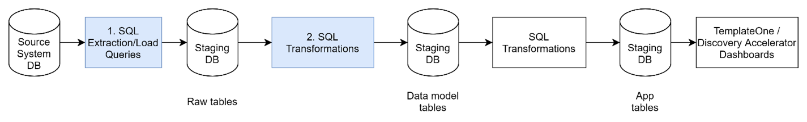
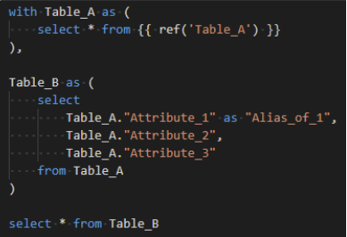

# Development
Connectors transform data from the source system into a data model that is suitable for Process Mining. Although connectors transform data from different source systems and for different processes, the same development steps apply. This document provides guidelines and best practices for the development of connectors.

## Design spec
A connector consists of an *extract and load* part and a *transforms* part. In the extract and load part, raw data is copied from the source system into a database. This is achieved by one of the extractors. The transform part transforms the raw data to the required data model.

### Extract and load
In this step, the data is kept in the same form as in the original database. Transformations should not happen in this part. The following guidelines apply:
- The queries for getting the data should be in an appropriate form for the system and extraction method.
- Columns that are not needed should not be loaded.
- The queries do not directly contain credentials or other secrets.
- The queries contain parameters for filtering on date ranges and other applicable concepts.

### Transforms
The transform step transforms the copy of the source systems input tables to the required data model. Depending on the process, the data model is either the generic process mining model (TemplateOne) or the process specific models (Discovery Accelerators P2P and O2C).
- TemplateOne data model, see [here](https://docs.uipath.com/process-mining/docs/input-tables-of-templateone).
- P2P data model, see [here](https://docs.uipath.com/process-mining/docs/input-tables-of-the-purchase-to-pay-discovery-accelerator).
- O2C data model, see [here](https://docs.uipath.com/process-mining/docs/input-tables-of-the-order-to-cash-discovery-accelerator).

It is advised to be familiar with the [Connector Development Kit](https://docs.uipath.com/process-mining/v2021.10/docs/kb-connector-development-kit) on UiPath docs. It will guide you through the different steps of writing the transformations. The following image is a visual representation of the steps described in the development kit.

The dotted-red line shows the difference between the data model for the Discovery Accelerators (P2P and O2C) and TemplateOne. For the Discovery Accelerators, the output data is expected to contain *entities* and *events*. For TemplateOne, a *cases* and *event log* table is expected. Another way to look at this image is that the steps left of the dotted-red line are *system specific* and the steps on the right *process specific*. The process specific transformations are expected to be source system agnostic.

## Best practices

### Project structure
The transforms folder contains the dbt project with the transformations. The transformations are split in several .sql files and grouped according to the steps described in the Connector Development Kit.

### Query structure
Each query in the dbt project creates one table in the database. In general the model is structered as follows:
- Refer to the tables on which the model is dependent.
- A SQL statement containing the transformations.
- The select * from the SQL statement.

Deviating from this structure may happen. For example, in the following two scenarios:
- When filtering can be applied based on a column defined in the SQL statement. For example, we want to filter `Table_B` on `Alias_of_1`, we write `select * from Table_B where Alias_of_1`.
- When we need a preprocessing step specific for the SQL statement. For example, we can define a `Table_B_preprocessing` such that `Table_B` is dependent on both `Table_A` and `Table_B_preprocessing`.

###  SQL specifics
- Always use explicit select statement and not `select *` for readability and maintainability of correct SQL models. Especially for unions, using the `select *` can throw errors. A union requires the fields to be the same and in the same order. If only one of the unioned tables changes, a `select *` does not work anymore.
- Prevent database specific SQL syntax where also a more generic syntax can be used. This makes it easier to re-use the connector for more databases and limits changes when another database is used.
    - If the connector needs to run on multiple databases, macros can be implemented to ‘choose’ which function to use. 
    - Do not use the alias of a column directly be in the same model. Some SQL dialects are not able to use the aliases directly.
- Consider how NULL values are handled in your database. For example, concatenation with NULL could result in a total value of NULL. That means that ‘Not_a_null_value’ + NULL results in NULL.
- Unions: the names and order of columns should exactly match. It may be necessary to create empty attributes on parts of the union to get all the attributes. This can be achieved by the select statement `NULL as "Attribute_X"`.

### Multiple databases support
The main purpose of the macros are to select a function based on the database using Jinja. See the [dbt documentation](https://docs.getdbt.com/docs/building-a-dbt-project/jinja-macros) for more information about Jinja and macros. For example, the string_agg() function in T-SQL is similar to the listagg() function in Snowflake. A new function string_agg() is implemented in the form of the following macro:

In the sql statement, the macro is used as follows:

`select {{ string_agg('“Attribute”') }} as “Aggregate_attribute”`

### Readability/consistency
- SQL commands and functions are written in lower case, which reads ‘more easily’.
- Use the same level of indentation for select, from, where, join, etc., to understand more easily the structure of the model.
- Use consistent naming conventions for tables and fields to prevent SQL errors that tables or fields do not exist in your database. We adhere to the following guidelines:
  - Tables and fields start with a capital.
  - Use between separate words in tables and attributes an underscore.
  - All attributes have quotes. For Snowflake, all attribute names will end up in the database with capital letters when written without quotes.
  - Tables do not have quotes. This is in favor of readability in combination with attributes having quotes.
  - Try to define your attributes as much as possible in an alphabetical order, unless a different order makes more sense.
- All attributes are prefixed with the table they originate from. This is required if an attribute exists in multiple tables which are used in the query, but not required if there is no such ambiguity. For understandability and to easier extend models with more tables we prefix the field by default.

### Performance

- Avoid `select distinct` where it is also possible to build an aggregate and just take one record.
- Use `union all` instead of `union`. Using the `union all` records from tables are concatenated, while `union` removes duplicates. In general, `union` does not have to be used with appropriate filtering beforehand.
- If you are working on a large dataset, you can limit the data you are working with during development by using `limit` in your models.
- All models are materialized as a table. This cost more diskspace to save the results, however the running time of the queries benefits greatly over the option where you materialized models as a view.

### Dbt documentation
There is quite a lot of information on how to build dbt projects on [dbt docs](https://docs.getdbt.com/docs/introduction). dbt also has an active community on Slack, to whom you can reach out when you are in need of help.

[![Slack Channel](https://img.shields.io/badge/slack-%23dbt--community-9cf?style=social&logo=data:image/png;base64,iVBORw0KGgoAAAANSUhEUgAAABAAAAAQCAMAAAAoLQ9TAAAABGdBTUEAALGPC/xhBQAAACBjSFJNAAB6JgAAgIQAAPoAAACA6AAAdTAAAOpgAAA6mAAAF3CculE8AAABzlBMVEUAAAA2xfAutn0vt342xvAut33gHlrssi7ssy/gHlvssy42xfA2xfA2xfA3xvYutXcutn0utn0utn03xvE2xfA2xvQutnkutn0utn02xfA2xfA2xfA2xvQutnoutn0utn02xvA2xfA2xfA2xfA2xfA3x/8utnwutn0vt342xfA2xfA2xfA2xfA2xfA2xfA4yf8utn0utn0utn0utn02xvQutnkutn0utn0utn02xfA2xvUutXgutn0utn0utn0utn0tzvgwy/UxyvU1xvE0x/Ewy/UuzPcq1P8ftXomtoEntoAAt5ATt4gotoAntoAktoHpFVLmGFXmGVX4B0X/ADbnGFToF1PsBVL8viX1sivysivusi3tsi3ysizzsiv3sirgHlrgHlrgHlrgHlrgHlrgF1ztuSzssi7ssi7gHlrgHlrgHlrgHlrgGVztuCzssi7gHlrgHlrgHlrgHlrgHlrgHVrv1iTssi7ssi7ssi7ssi7ssi7ssi7hH1vgHlruxyjssi7ssi7ssi7ssi7ssi7gHlrgGlvsty3ssi7ssi7ssi7hHlrgHlrgGVzstyzssi7tsy/gHlrfFl3tuizssi42xfAutn3gHlrssi7///+Vukr7AAAAlXRSTlMAAAAAAAAAAAAAAFju2C4u2O5XAaZvb6gCaO36dHmxBAIECTVCG3uwAVeosbCugw8JZ6ZYY3iuNe34U1L4g0L6Lm95e3t4UgcHU2MPG3RvLi5vdBsPY1MHB1J4e3t5by7Y+kKD+FJT+Nju7TWueGPuWKZnCbB7D4OusLGoVwEEG0I1CQQCsXl0+u1oAqhvb6YBVy4uWNqBwKcAAAABYktHRJkB1jaoAAAAB3RJTUUH5QIEEjEQu7eEbgAAAQBJREFUGNMdj9VCQkEUAM+uumuAgt2IHdid2N3dYoOFrRgY2F2ccz9X7p23mbcBAMZCdPrQMIMxnPuBCouI9HqjohFjYrlP/RljcfEJiUmIySbOA4ClmM2paekZmYhZJp7NISc3z2LJLyhUQ1FxSSnovBpl5YgVlVVoBL3m1TW1dVjfYEUDNDY1t7S2tXd0dnX39Pb1D8Dg0PDI6Nj4xOTU9Mzs3PwC2GhxaZlWVtfWFRU7OGhjc4toe0dzxQm7e/sHh0RHxyenLtfZ+QWIS+FWw9X1za3HcydBCOG+J3p4fHp+kVIG+m7E6xvR+4eifH5J7TZIfDtsP792558MBvgHJWxO8mpdwJAAAAAldEVYdGRhdGU6Y3JlYXRlADIwMjEtMDItMDRUMTg6NDk6MDQrMDA6MDDEvgYEAAAAJXRFWHRkYXRlOm1vZGlmeQAyMDIxLTAyLTA0VDE4OjQ5OjA0KzAwOjAwteO+uAAAAABJRU5ErkJggg==)](https://www.getdbt.com/community/join-the-community)
