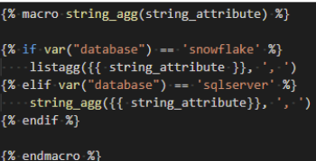

# Learnings and best practices

## Project structure

In DBT, one query (select-from-where) is named a model. In a DBT project, the folder ‘models’ consists of the separate .sql files where in each file one query is defined.

- <https://docs.getdbt.com/docs/guides/best-practices>
- <https://discourse.getdbt.com/t/how-we-structure-our-dbt-projects/355>
- <https://discourse.getdbt.com/t/why-the-fishtown-sql-style-guide-uses-so-many-ctes/1091>

Some points that are discussed in the above links:
-Limit references to raw data where you rename/cast fields once
-Break complex models up into smaller pieces
-Add tests to your models
-The Fishtown’s style guide (developers of DBT)

Compiling/running a DBT project results in separate compiled .sql files for each of the created models. You can run specific sets of models instead of always your whole dbt project. See for info: <https://docs.getdbt.com/reference/node-selection/graph-operators>

## Model/query structure

- Always use explicit select statement and not `select *` for readability and maintainability of correct SQL models. Especially for unions, using the `select *` can throw errors. A union requires the fields to be the same and in the same order. If only one of the unioned tables changes, a select * does not work anymore.
- Prevent database specific SQL syntax where also a more generic syntax can be used. This makes it easier to re-use the connector for more databases and limits changes when another database is used.
  -If the connector needs to run on multiple databases, macros can be implemented to ‘choose’ which function to use. For an overview of the SQL functions used in the SAP-P2P DA connector and how we handled compatability with Snowflake and SQL server, see: (SAP-P2P DA Connector page on conf. this will be inserted)

## Readability/consistency

- SQL commands and functions are written in lower case, which reads ‘more easily’.
- Use the same level of indentation for select, from, where, join, etc., to understand more easily the structure of the model.
- Use consistent naming conventions for tables and fields to prevent SQL errors that tables or fields do not exist in your database. We adhere to the following guidelines:
  - Tables and fields start with a capital.
  - Use between separate words in tables and attributes an underscore.
  - All attributes have quotes. Without quotes all attribute names will end up in the database with capital letters (Snowflake).
  - Tables do not have quotes. This is in favor of readability in combination with attributes having quotes.
  - Try to define your attributes as much as possible in an alphabetical order, unless a different order makes more sense.
- All attributes are prefixed with the table they originate from. This is required if an attribute exists in multiple tables which are used in the query, but not required if there is no such ambiguity. For understandability and to easier extend models with more tables we prefix the field by default.

## Performance

- Avoid `select distinct` where it is also possible to build an aggregate and just take one record.
- Use `union all` instead of `union`. Using the union all records from tables are concatenated, while union removes duplicates. In general `union` can be prevented with appropriate filtering beforehand.
- If you are working on a large dataset, you can limit the data you are working with during development by using `limit` in your models. If you want you can add them in your query, where they are only executed if you change a certain setting:

`select A`
`from B`
`where C`
``
`limit 100`
``

See [Jinja and Macros | DBT docs](https://docs.getdbt.com/docs/building-a-dbt-project/jinja-macros) for more information.

- All models are materialized as a table. This cost more diskspace to save the results, however the running time of the queries benefits greatly over the option where you materialized models as a view.

# How to validate

The DBT project is just the set of queries that transforms the raw data into the transformed data. The actual data is stored in the database, for example, Snowflake. To inspect the data at each transformation step you need to inspect the data within the database.

For general validation checks, tests can be implemented in the DBT project: [Tests | dbt Docs](https://docs.getdbt.com/docs/building-a-dbt-project/tests)

Validation workflow:

- Consider you have model A and model B, which you join together to create model C. You want to validate the results of model C.

- You need to run all models to create the tables in the database.
  - Run all models by the command ‘dbt run’
  - Run one model by the command ‘dbt run -m model_A’
  - Run multiple models by the command ‘dbt run -m model_A model_B’
- You can only run model C the moment model A and model B are defined, because model C is dependent on the other two models.
- Inspect the data in the database, where tables for model A, B, and C are created.
- Best practice: make sure to run (with a subset of the data) at least all models you have changed to see whether there are any SQL errors before comitting/merging your changes.
- Write `limit` 10 in the end of a query to only get 10 records for validation.
- Make sure to clean up unused models in the database, which may be created during testing or became redundant after refactors.

Useful query to inspect the record count related to a specific field in a table:

`select “Field”, count(“Field”)`
`from Table`
`group by “Field”`

# SQL learnings

- Consider how NULL values are handled in your database. For example, concatenation with NULL could result in a total value of NULL. That means that ‘Not_a_null_value’ + NULL results in NULL.
- Text strings are written with single quotes.
- Unions: columns should exactly match (names and order). It might be necessary to create empty attributes on parts of the union to get all the attributes (f.e. `NULL as “Attribute_X“`)
- There is a difference between `union` and `union all`: using union, duplicate records are removed, but the performance is lower than when using union all.
- When do you put something in the `where` clause and when in the `on` in a join:
  - [Difference between WHERE and ON](https://dataschool.com/how-to-teach-people-sql/difference-between-where-and-on-in-sql/)

## Making a variable for database specific functions

 This is possible based on macros. See section ‘Macros’ in the "Implementation details" section.

# Implementation details

The connector is compatible with Snowflake and SQL server (T-SQL). Not all SQL functionality is available in both databases in the same way. This means that we adhere to guidelines related to the model structure and functions such that they work on both databases. The most important ones are:

- An alias of a column can not directly be used in the same model.
- Use generic SQL functions where possible.
- For non-generic SQL functions, implement a macro with jinja syntax to choose the SQL specific function of the database.

## Model structure

Each model (one .sql file) in the dbt project creates one table in the database. In general the model is structered as follows:

1- Refer to the tables on which the model is dependent.
2- A SQL statement containing the transformations.
3- The select * from the SQL statement

We try to only deviate from this structure in two scenarios:

- When filtering can be applied based on a column defined in the SQL statement. For example, we want to filter `Table_B` on `Alias_of_1`, we write `select * from Table_B where Alias_of_1`.

- When we need a preprocessing step specific for the SQL statement. For example, we can define a `Table_B_preprocessing` such that `Table_B` is dependent on both `Table_A` and `Table_B_preprocessing`.

## Macros

The main purpose of the macros are to select a function based on the database using Jinja [Jinja & Macros | dbt Docs](https://docs.getdbt.com/docs/building-a-dbt-project/jinja-macros). For example, the string_agg() function in T-SQL is similar to the listagg() function in Snowflake. A new function string_agg() is implemented in the form of the following macro:

In the sql statement, the macro is used as follows:

`select {{ string_agg('“Attribute”') }} as “Aggregate_attribute”`

## SQL functions

Snowflake: [SQL Function Reference - Snowflake Documentation](https://docs.snowflake.com/en/sql-reference-functions.html)

SQL Server/T-SQL: [What are the Microsoft SQL database functions? - SQL Server](https://docs.microsoft.com/en-us/sql/t-sql/functions/functions?view=sql-server-ver15)
