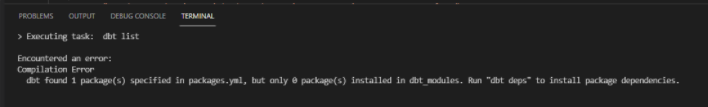

# SQL connectors: testing

This section describes how to test the implementation and correctness of the connector. The dbt framework offers out of the box functionality to help implement tests.

## Type of tests

On the following levels of the transformations we have different type of tests implemented:

- Input tests
- Transformation tests
  - For P2P DA connector these are the intermediate transformations to create entities and events.
- Output tests

**Input tests**

On the first level, we load in the raw data from the source and cast this data to the correct data type. Also filtering is applied where applicable.

- `Error` Uniqueness for the primary keys. This may be a combination of multiple columns. If the primary key is already not unique in the input table, then it may cause issues later on in the transformations. It is best to check this as early as possible.

- `Error` Not having null values for the primary keys/columns that form the primary key. Having null values may result in incorrect primary keys or in duplicate values.

- `Warning` Attribute length is as expected. Especially with the experience in SAP, key values may start with leading zeros that may be missing if the input is corrupted. However, this is not a hard requirement, as having unexpected lengths is possible or may not lead to issues.

**Transformation tests**

Multiple transformation steps take place between the raw input and the output. Joining tables incorrectly may result in unexpected record counts or duplicate IDs.

- `Error` Uniqueness for the ID columns in the entity tables.
- `Error` Not having null values for the ID columns in the entity tables.
- `Error` Not having null values for the mandatory columns in the events tables, which are the entity ID, activity, and event end.
- `Warning` Uniqueness for the combination of mandatory columns in the events tables. In general, we would not expect that the same activity for the same entity happens at the exact same moment. This could mean a duplication of event records. However, it may be expected behavior. For example, in case the event end only consists of the date and not the exact time, it may happen that the same event happens twice that day.
- `Error` Only one create event per entity instance. For example, a specific purchase order can only be created once in the event log. Having the creation event twice would indicate a duplication of events.

**Output tests**

The output of the transformations should match the input of the ‘app transformations', which is the expected  schema of the corresponding app. 

- `Error` Not having null values for the mandory columns. These are, for example, the IDs.
- `Error` Uniqueness for the ID columns.
- `Error` Existence of all columns. Some columns may not contain any values, but to match the app transformations the columns should at least be present in the output.
- `Error` Data types are as expected. For example, columns that are expected to contain boolean values should be of type boolean and not be numeric or dates. If this differs from the expected types, app transformation could not be performed on these columns resulting in either errors or null values.
- `Error` Equal record counts from raw data to output where applicable. For example, the number of records in the EKKO table should be the same as in the purchase order entity table, purchase order create events table, and the output table. Otherwise, purchase orders might have been duplicated or missing along the transformation steps.

Snowflake does not have functionality to check the existence of all columns. For this test, we select the column to be checked, but when the column does not exist a SQL compilation error occurs. The fact that a compilation error occurs also indicates that the column is not present in the table. See the below screenshot for the difference in results given by dbt. The “Approval_status” could not be found in the output table “Purchase_orders_base”. This is indicated by the ERROR. The “Creation_date” contains null values, while it is a mandatory attribute. This test could be implemented and returns a FAIL.

## Warnings vs Errors

- `Error` in case the data is incorrect in such a way that the data can not be visualized/analyzed later on or leads to incorrect values. For example, unexpected duplication of records.
- `Warning` in case there is a large probability for incorrect data, but that the behavior on which is checked is not a hard requirement. For example, attributes having an unexpected length.

Note that having tests that return either a warning or an error do not prevent generating the data. 

## How to write tests 

Each tests is a separate SQL query. For a test, the following logic is used: a test succeeds if 0 records are returned and a test fails if at least 1 record is returned. 

Example: table T has column_A with values of either length 3 and 4. We expect that all lengths should be 3 for which we can write the following test:

`select column_A`

`from T`

`where len(column_A) <> 3`

This query returns all records where the values have a length 4, resulting in the test to fail. If all records would have had the value 3, this query returns 0 records.

## Testing using dbt

In this framework there are two types of tests which can be done. These are:

- Generic tests: tests implemented as a macro. Examples that are out of the box available in dbt are unique and not_null checks on columns in your data.

- Besproke tests: tests implemented as general queries on specific tables instead of in the form of a macro.

More detailed information on what the difference is on these tests can be found on [Tests | dbt Docs](https://docs.getdbt.com/docs/building-a-dbt-project/tests)

A summary on what is described in the DBT documentation:

- Tests should return 0 records to succeed (or specified otherwise by using the fail_calc config).
- To run tests, there are several useful commands
  - `dbt test`: run all your tests
  - `dbt test --schema`: run all your schema tests
  - `dbt test --data`: run all your data tests
  - `dbt test --schema --models model_1 model_2 etc.`: run the schema tests for specific models.
  - `dbt test --data --models model_1 model_2 etc.`: run the data tests for specific models.
- The severity of a test is default set to error. It is possible to set the type to a warning.

Tip: running tests (and also models) creates a lot of compiled code in your project which will not get cleaned automatically. It is wise to run the command dbt clean every once and a while to cleanup this folder. Note that this command should be executed on the main folder of you application for it to work.

**Out of the box tests offered by DBT**

The tests ‘unique_combination_of_columns' and 'equal_rowcount’ require the package 'dbt_utils' to be installed. You can install this by running 'dbt deps' in your terminal. If you have not yet installed this package, you will see the following message in the terminal. Note that tests from this package are not all compatible with dbt-sqlserver.

