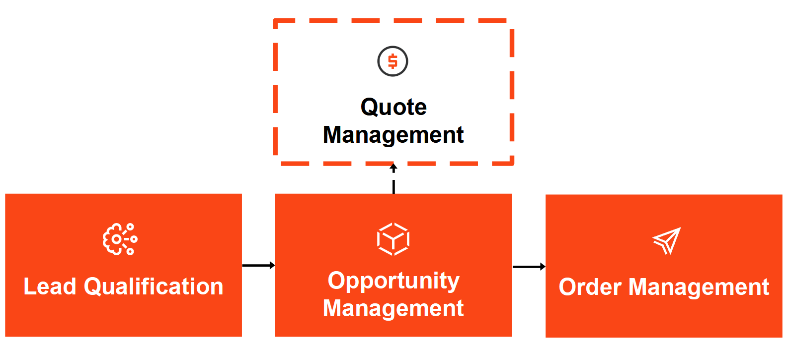
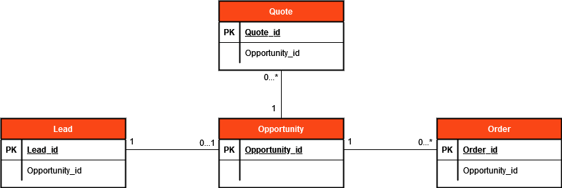

# \<apptemplate-name>

<!-- TOC -->

* [Process description](#process-description)
    * [Available tags & due dates](#available-tags--due-dates)
* [Extraction](#extraction)
    * [System configuration](#system-configuration)
    * [Extraction tool configuration](#extraction-tool-configuration)
* [Input data](#input-data)
    * [Input types](#input-types)
    * [Input tables & fields](#input-tables--fields)
* [Configuring transformations](#configuring-transformations)
    * [Seed files](#seed-files)
    * [Dbt variables](#dbt-variables)
* [Design specifications](#design-specifications)
    * [Entities](#entities)
    * [Activities](#activities)
    * [Design details](#design-details)

<!-- /TOC -->

---

## Process description

\<The Process description and Available tags & due dates sections are only needed for TemplateOne app templates. For process-specific app templates, link to the corresponding app template documentation.>

\<Provide high level description of the process for which this app template was built. Update the high-level process image below.>

### Available tags & due dates

The following tags are available by default.
|Tag   |Description          |
|:-----|:--------------------|
|Tag A |Description of Tag A |
|Tag B |Description of Tag B |

The following due dates are available by default.
|Due date   |Description               |
|:----------|:-------------------------|
|Due Date A |Description of Due Date A |
|Due Date B |Description of Due Date B |

---

## Extraction

### System configuration

The data extraction is developed for **\<source system name>**.

\<Add other restrictions on the source system, like specific (minimum) versions.>

#### System config sub-section A
\<Explain larger system configuration topics in separate sub-sections like this one.>

### Extraction tool configuration

Below is a description on how to use CData Sync to set up a source connection and load data into Process Mining.

In general, you should follow the steps as described in [Loading data using CData Sync (Automation Cloud)](https://docs.uipath.com/process-mining/automation-cloud/latest/user-guide/loading-data-using-cdata-sync) to set up data loading using CData Sync. **Note**: If you are using Automation Suite, make sure to select `AUTOMATION SUITE` as the `DELIVERY` option on the documentation page. In addition, select the Automation Suite version you are using to open the appropriate Loading data using CData Sync page.

#### Extraction tool config sub-section A
\<Explain larger extraction tool configuration topics in separate sub-sections like this one.>

---

## Input data

### Input types

The following table provides an overview of the different field types and their default format settings.

\<Update/add field types with the correct descriptions.>
|Field type	|Description                                            |
|:----------|:------------------------------------------------------|
|boolean    |`true`, `false`, `1`, `0`                              |
|date       |`yyyy-mm-dd`                                           |
|datetime   |`yyyy-mm-dd hh:mm:ss[.ms]`, where `[.ms]` is optional  |
|double     |Decimal separator: `.` (dot); thousand separator: none |
|integer    |Thousand separator: none                               |
|text       |N/A                                                    |

### Input tables & fields

\<Add all input tables to the following list. Add sub-sections + tables for each table.>

The following tables are extracted from the source system:
- Table A
- Table B
- Etc.

#### Table A
\<Shortly explain what the table represents. Add filtering on table if applicable.>

|Field   |Type     |Description                                     |
|:-------|:--------|:-----------------------------------------------|
|Field A |text     |Example: User who created the record.           |
|Field B |datetime |Example: timestamp when the record was created. |

Filtering: only records after a certain time (based on `Field B`) are selected.

---

## Configuring transformations

\<Explain all ways to **configure** transformations out-of-the-box.>

### Seed files

#### Seed_file_A
\<Explain what the goal of this seed file is. Describe fields in the table below.>

|Field   |Type |Description            |
|:-------|:----|:----------------------|
|Field X |Text |Description of Field X |

### Dbt variables

|Variable   |Type    |Description               |
|:----------|:-------|:-------------------------|
|Variable X |Boolean |Description of Variable X |

---

## Design specifications

### Entities

The following diagram shows all entities that are used for the process.

\<Provide Entity Relations Diagram of the process.>

\<Add all entities in the following table. Add the tables from the input data that are used to generate each entity.>
|Entity   |Input Data                |
|:--------|:-------------------------|
|Entity A |Table A, Table X          |
|Entity B |Table B, Table C, Table X |

### Activities

\<Add all generated activities in the following table.>
|Activity   |Entity   |Description                                                                                                        |
|:----------|:--------|:------------------------------------------------------------------------------------------------------------------|
|Activity A |Entity A |Description of what this activity means. Add information how (and based on which fields) this activity is created. |
|Activity B |Entity B |Description of what this activity means. Add information how (and based on which fields) this activity is created. |

### Design details

\<Add all other important design information to this section. This can either be a known limitation, troubleshooting or add more sub-sections if needed.>

#### Known limitations

* **Limitation 1:** Description of limitation 1. 
* **Limitation 2:** Description of limitation 2. 

#### Troubleshooting

* **Troubleshooting 1:** Description of troubleshooting 1.
* **Troubleshooting 2:** Description of troubleshooting 2.
