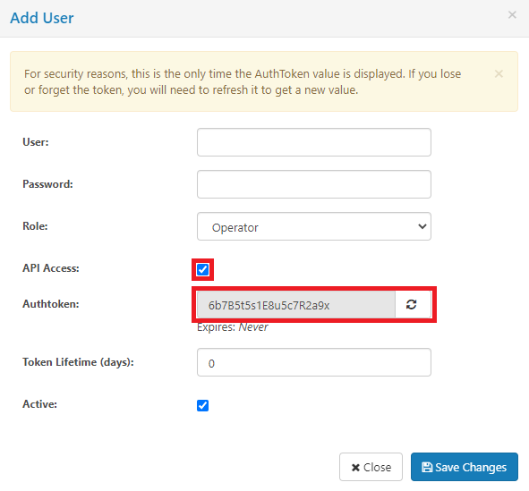

# Extractor automation

Regular data extractions are useful to keep the data in the DA's up to date. This guide describes the prerequites for having automated data refreshes as well as tips and customizing posibilities.
The use case for automating the extraction is using the CData Sync software on a Windows machine, but this could be adapted to the extractor software/OS of choice. In [Extractor guidelines](extractor_guidelines%20%(Generic).md) a description of how the built-in scheduler can be configured is given. This guide helps you include the extraction automation in a larger ETL pipeline.

## Prerequisites

There are several requirements that have to be met for an extractor scheduler to work.

1. An user with administrator rights is needed for deployment.
2. CData Sync has to be installed and running.
3. An authtoken for an user in CData Sync needs to be defined such that the extraction execution is authenticated.
4. A "job" has to be defined in CData Sync.
5. A scheduler of choice is needed to periodically extract the data. Windows Task Scheduler is used in this guide.

## Configuration

This extractor can be run by executing the **extraction.ps1** file in the **scripts** directory. There are several parameters to be set for this command to execute.

**URL**: Adress of the CData Sync host. By default, only localhost connections are allowed.

**authtoken**: Unique authentication string of a user. This string is only available upon the user creation in CData Sync.

**job**: The name of a job configuration is needed. This is already described in [Extractor guidelines](extractor_guidelines%20%(Generic).md).

An example of a successful run is given below. Note that the POST request returns a message giving the status of the request.

## Scheduling

As an alternative to the built-in job scheduling feature of CData Sync, one could build a custom task in Task Scheduler to trigger the data extraction.

[Here](https://www.windowscentral.com/how-create-automated-task-using-task-scheduler-windows-10) is some documentation on how to set this up in Windows. Note that only the batch file is needed to run the job.
