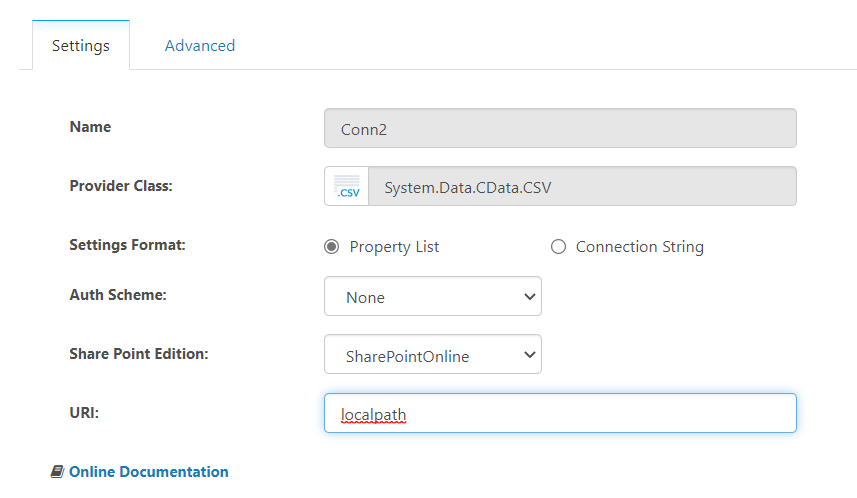
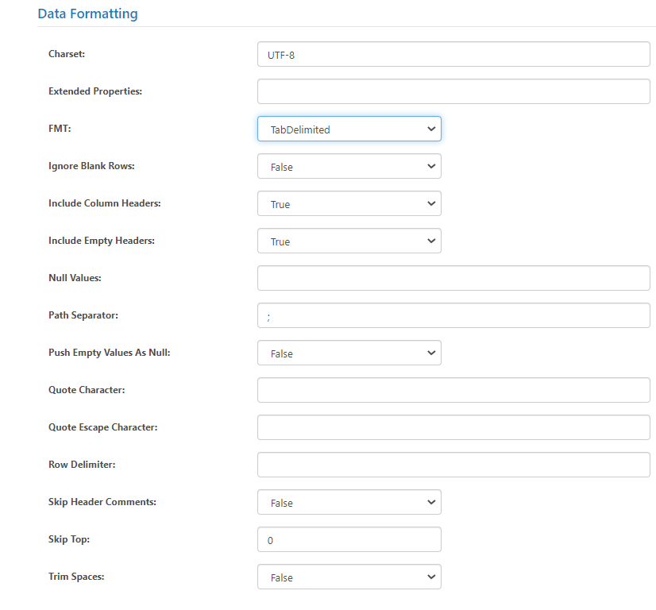
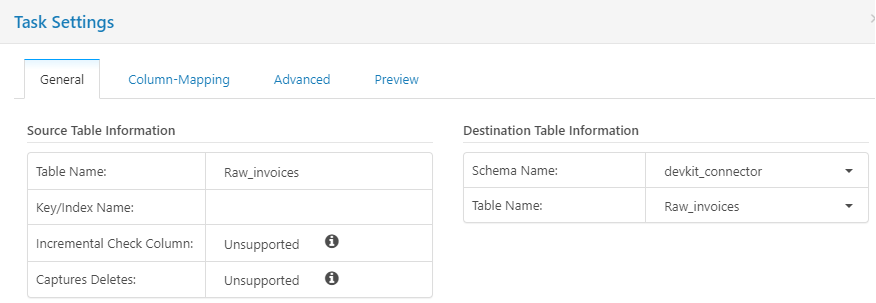
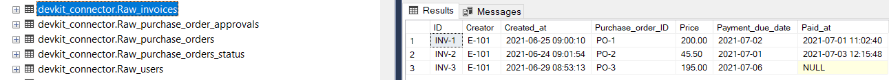

# Extraction (this part will be inserted within the README.md)

This document provides the detailed information about the procedure to be followed for a data extraction for devkit-connector using a CSV connection and a SQL server as destination.

To obtain the files in the destination server, Cdata connectivity platform will be utilized.

Installation can be realized using this [link](https://www.cdata.com/sync/download/).

## Licensing for the platform

TBD

## Connection

As a first step, source and destination configurations should be completed on CDATA. Also, related schema on SQL server will be established for the data extraction.

- CSV connection settings:
The CSV file connection can be set either using a local file path or an online document storage using the correct credentials. Local file location is provided for this example.

In the "Advanced" page, you can find the `data formatting` section for the specified connection type. In this section, manual file formatting can be realized if needed. The file format can also be changed in the `FMT` button in `Data formatting`. Even tough the connection type is marked as CSV connection, we will be using .tsv files, therefore "TabDelimited" option needs to be chosen.

-SQL server settings:
The connection for SQL server is defined as below:

After the configurations are set for both source and destination on CDATA, job scheduling can be customized according to the data extraction frequency needed.

To complete the datapipeline, and to be able to insert the extracted source data to correct schema within the SQL server, schema name needs to be defined on the job settings which is "devkit_connector" for this example:

The source folder can consist of multiple files. In that case, each .tsv file can be specified within the task settings. Therefore, the related jobs should also be run separately for each file.

After the settings are completed for the related job, the extraction and load can be initialized using "Run" command:

The logs created for this task can be found in the `Logging and history` section in `Job settings` page.

The data records tranferred to the destination server can be found under the related schema with the file name defined in the source settings, i.e. "Raw_invoices".

