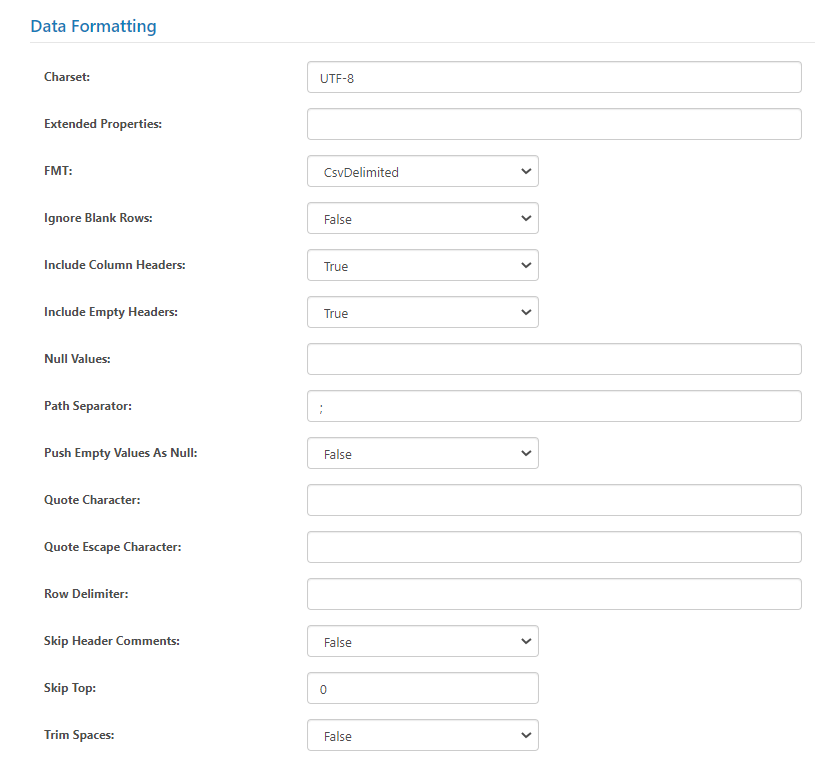

This document provides the detailed information about the procedure to be followed for a data extraction for devkit-connector using a CSV source and a SQL server as destination.

As a first step, source and destination configurations should be completed on CDATA. Also, related schema on SQL server should be established for the data extraction.

- CSV connection settings:
The CSV file connection can be set either using a local file path or an online document storage using the correct credentials. Local file location is provided for this example.

In the "Advanced" page, you can find the `data formatting` section for CSV connection. In this section, manual file formatting can be realized if needed.

-SQL server settings:
The connection for SQL server is defined as below:

After the configurations are set for both source and destination on CDATA, job scheduling can be customized according to the frequency needed for the related data.

To complete the datapipeline, and to be able to insert the extracted source data to correct schema within the SQL server schema name needs to be defined on the job settings which is "devkit_connector" for this example:

After the settings are completed for the related job, the extraction and load can be initialized using "Run" command:

