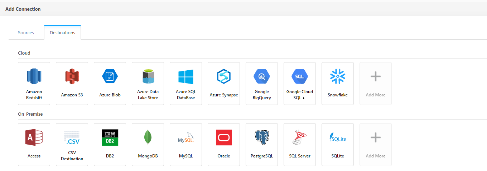
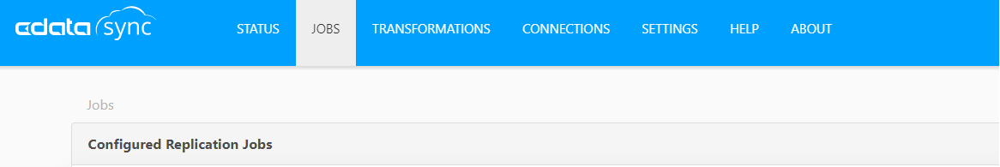
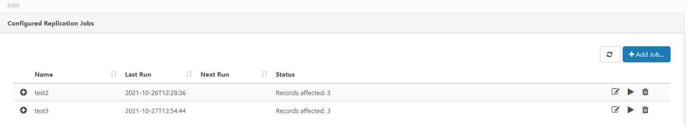

# Extractor guidelines

To provide the connection and integration between the source system and the destination server, Cdata connectivity platform will be used. The detailed information about this platform can be find [here](https://www.cdata.com/solutions/connectivity/).

In this document, the instructions for the extractor configurations will be provided.

## Installation

TBD

## Configuration

### Connection

    To create the connection between the source and the destination system, the steps are defined as:
        1- Setup for the source system
        2- Setup for the destination
        3- Job scheduling

#### Setup for the source system

Depending on the type of the source system, Cdata offers different connection types. To obtain the detailed information on the connector types and the source systems, see [here](https://www.cdata.com/drivers/).

To provide the configurations for the extraction pipeline, web application interface of "Cdata Sync Admin Console" is used.

In `Connections` page, suitable source system can be chosen:

**Related data extraction example is provided in "extraction_example.md" file.**

#### Setup for the destination system

Cdata Sql server connection will be used as a destination for the datapipeline. The selection for the destination system can be made in "Connections" page `Destination` section.

After the server selection is made, the relevant credentials are provided within the connection as follows:

#### Job configuration

To provide the connectivity and trigger the data extraction between the source system and the destination, the jobs are established and configured using the tables that are obtained from the source system.

1 - Using the left "Add job" button, source and destination are chosen.

2 - In job settings, relevant tables are chosen using the "Add tables" button.

3 - After the tables are defined, the task settings can be viewed by clicking on the listed task.
4- In "General" section, Schema Name is defined under the Destination Table Information.
5- To change the mapping or to provide additional settings for the columns, "Column-mapping" section is used.
6- Additional replication options are also available on the "Advanced" section.
7- After the configurations are set, data can be viewed using "Preview" section.
